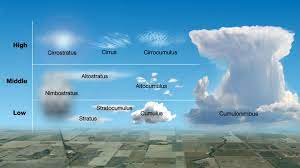
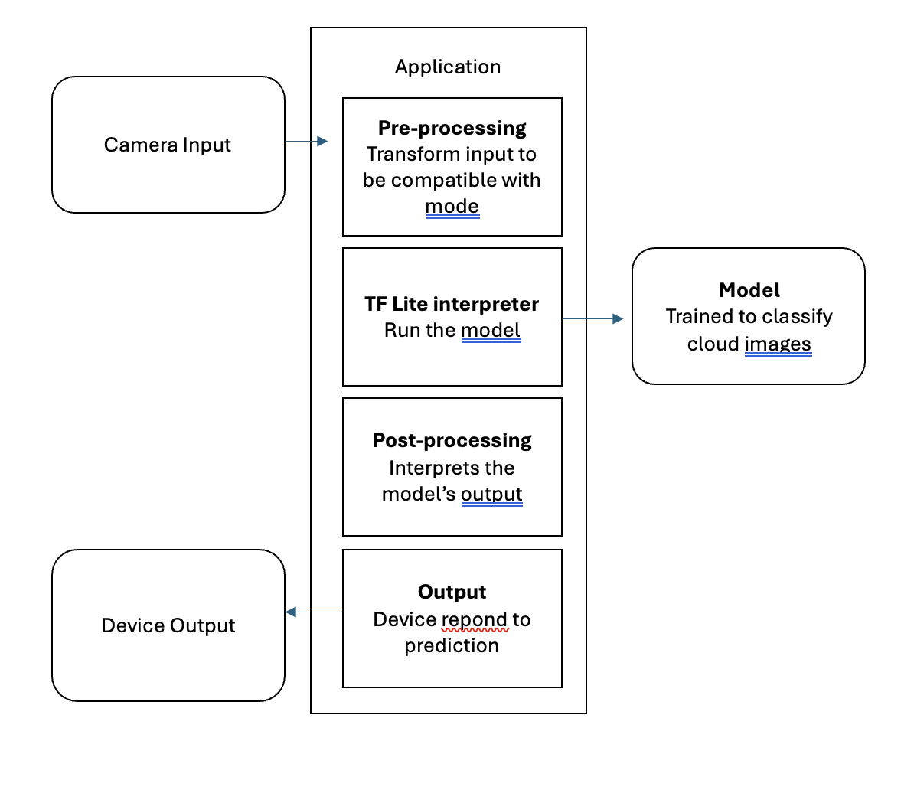
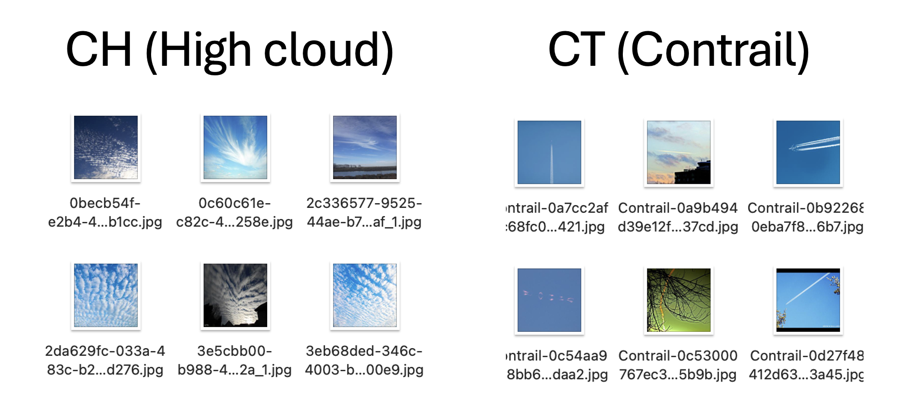

# Cloud Classification App: An application to classify cloud type in realtime

Author name: Satria Mitra Utama  
Github repo: https://github.com/satria-mitra/CASA0018-Cloud-Classification   
Video presentation: youtube   

## Introduction
Clouds play a crucial role in our daily lives, affecting everything from the weather to the climate. Cloud types have an impact of Earth's energy balance (Hartmann, L, D., Ockert-Bell, M. and Michelsen, L, M., 1992) and global radiation.  (Chen, T., Rossow, B, W. and Zhang, Y., 2000). Thus, understanding cloud is an important task in environmental monitoring and meteorology to improve weather prediction and assessing climate models. Thus, understanding cloud is an important task in environmental monitoring and meteorology to improve weather prediction and assessing climate models. This project will explore the use of Deep Learning models to automatically classify and identify different types of clouds based on ground-based cloud images. 

Luke Howard in 1802 proposed cloud classification into three types, Cirrus, Cumulus & Stratus. And then World Meteorological Organizations (WMO) extended Luke Howard's idea to group cloud types into three levels, namely low level (CL), middle level (CM), and high level (CH). Each of these groups is further divided into 10 cloud types based on the International Cloud Atlas Weather Meteorological Organizations. (World Meteorological Organizations, 1975). This project will only focus on the three types of cloud based on height level with additional of Contrail.

     

Figure 1. Cloud type

Until now, observations of cloud types by meteorologists are still mostly done manually using the human eye. Even though the human eye can recognize cloud types well, there are still many differences of opinion among meteorologists in recognizing cloud types. This is where Deep learning methods come into play, as they can automatically extract features from cloud images and classify them.Some Deep Learning method use cloud images from satelite data (Cai, K. and Wang, H., 2017) (Guo, Y. et al., 2020) for cloud classification, while others use ground-based cloud images captured by instruments like the total sky imager (Zhu, T., Liang, W. and Guo, Y., 2021).
The goal of this project is to develop a deep learning model that can accurately classify different types of clouds based on ground-based cloud images 

## Research Question
Can cloud be classified on real-time event based on the images input by leveraging a deep learning model on an edge device (like mobilephone) ?

## Application Overview
This project will try to classify cloud into 3 types of cloud plus additional of contrail, the condensation trail that is left behind by a passing jet plane. The goal of this project is to develop a deep learning model that can accurately classify different types of clouds based on ground-based cloud images. The image input is a picture taken on the smartphone by using a Flutter based application with Tensorflow library installed. Tensorflow model will run on the Flutter app, and detect and classify image on the go. Deep learning model is built, trained and converted to the Tensorflow lite model in the Google Colab environment. 

     

Figure 2. Cloud classification model

## Data
Initially, CCSN dataset (Cirrus cumulus stratus nimbus (CCSN) database, 2019) which classify cloud into 10 types + 1 contrail is being collected. For simplicity and as a prove concet of Deep Learning, this dataset is modified, merging some cloud types into 3 types of cloud based on their height level with contrail picture is added. A little inspection was done to check and remove for dirty picture, where there is too much additional 'information' on the cloud picture such as building or landscape. This cleaning step is crucial as the project would like to deploy a deep learning model in the real condition.

     

Figure 3. Datasets

Regarding the total pictures for the 4 categories, there is a data imbalance between cloud images and contrail images. There are 900 images of each cloud type and fewer than 300 contrail images when this dataset was first downloaded. For this reason, I looked for additional datasets from the image repository, such as flickr.com. By using code from [pyimgdata](https://github.com/jeffheaton/pyimgdata) (Heaton, 2020) which was developed by [Jeff Heaton](https://www.heatonresearch.com/), I can bulk download images from Flickr by using spesific keyword and save the images to my Google Colab environment. The final datasets contain 600 pictures of each type of cloud and contrail, so it was 2400 images in total. The data was further split into 60% (360x4 images) for the training dataset, 20% (120x4 images) for validation and 20% (120x4 images) for testing.

## Model
Experiments are carried out to get the best accuracy from the testing session. 3 models based on Keras framework were developed to find out the best results for classifying clouds. The first one is Keras sequential model, the second one is Transfer Learning, and the last one is Fine-tuning the pre-trained model. From the experimental results described in the table below, it can be seen that it has the best performance in terms of accuracy

## Experiments
The experiment focused on the xxx model which was proven to have the best accuracy results in the previous testing session. The xxx parameters shown in table xx were tested to find out more about the performance of the xxx model. The experiments focused on optimizing the number of epohs, batch size and type of optimizer
- Optimizer: The first experiment was to try 3 types of optimizer with learning rate and batch size fixed as 0.001 and 32. I evaluated the optimizer based on the accuracy score on the validation test. Table xx shows the different accuracy scores for each type of optimizer. It can be seen that xxxx optimizer shows the best accuracy results
- Learning rate
- Batch Size

After the experiment is complete, the parameters selected are:

## Testing on real-world
Experiment conducted by deploying the Tensor Flow model on a mobile phone based on the Flutter application. There are several reasons why mobile phones are chosen over microcontrollers. First, a mobile application that is integrated with a Deep Learning model can be developed to be able to take pictures or use photos from the internet to quickly differentiate cloud types. Users can immediately take out their mobile phone and point it at the sky to find out what types of clouds they don't recognize directly. Second, considering the complexity of the image classification model, mobile phones have advantages in terms of storing complex models, rapid inference and high resolution photo capabilities. Real-world experiments show that the application can work during the day. 

## Results and Observations
1. Data
2. d
3. 
## Bibliography
1. Cai, K. and Wang, H. (2017) Cloud classification of satellite image based on convolutional neural networks. Available at: https://doi.org/10.1109/icsess.2017.8343049.
https://doi.org/10.1088/1742-6596/1617/1/012089.
2. Cirrus cumulus stratus nimbus (CCSN) database (2019). Available at: https://doi.org/10.7910/DVN/CADDPD.
3. Chen, T., Rossow, B, W. and Zhang, Y. (2000) "Radiative effects of cloud-type variations," , 13(1),p. 264-286. Available at: https://doi.org/10.1175/1520-0442(2000)013<0264:reoctv>2.0.co;2.
4. Guo, Y. et al. (2020) "Cloud Detection for Satellite Imagery Using Deep Learning," Journal of physics. Conference series, 1617(1),p. 012089-012089. Available at: https://doi.org/10.1088/1742-6596/1617/1/012089.
5. Heaton, J. (2020) Pyimgdata, GitHub. Available at: https://github.com/jeffheaton/pyimgdata (Accessed: 23 April 2024). 
6. Hartmann, L, D., Ockert-Bell, M. and Michelsen, L, M. (1992) "The Effect of Cloud Type on Earth's Energy Balance: Global Analysis," American Meteorological Society, 5(11),p. 1281-1304. Available at: https://doi.org/10.1175/1520-0442(1992)005
7. World Meteorological Organization, 1975. Manual on the Observation of Clouds and Other Meteors. Secretariat of the World Meteorological Organization.
8. Zhu, T., Liang, W. and Guo, Y. (2021) Cloud Classification of Ground-based Cloud Images based on Convolutional Neural Network. Available at: https://doi.org/10.1088/1742-6596/2035/1/012020.

----

## Declaration of Authorship

I, SATRIA MITRA UTAMA, confirm that the work presented in this assessment is my own. Where information has been derived from other sources, I confirm that this has been indicated in the work.

*Satria Mitra Utama*

25 April 2024
